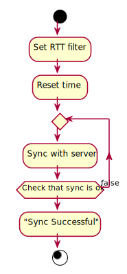

# Documentation for SoundZone Client
<!--
To compile puml use: (Assuming plantuml you are in the directory)
plantuml.jar -tsvg readme.md -o diagrams
-->

version = 0.1.0

## Dependencies
| Dependency | Version number |
|---|---|
|szs_soundzone_protocol|0.2.0|
|szs_time_sync|0.2.1|


## Flow run

<!--
```
@startuml flow_run

start

:Set RTT filter;
:Reset time;
repeat
    :Sync with server;
    repeat while (Check that sync is ok) is (false)
:"Sync Successful";

stop

@enduml
```
-->


